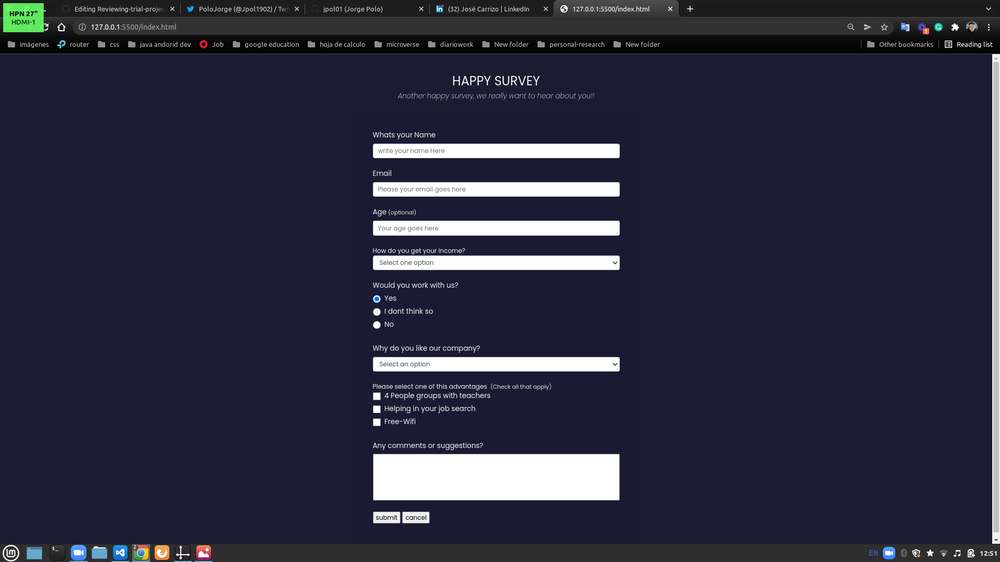

# Reviewing-trial-project

> Objective: Review of a personal pervious work, using the point of view a Code Reviewer
> Follow and understand the code reviewing process.
> This project was inspired by the original version done by _Jorge Polo_, my coding partner. You can see his version [here](https://github.com/jpol01/Reviewing-trial-project)

Additional description about the project and its features.

## Built With

- Html
- Css
- GitHub

## Live Demo

[Live Demo Link](https://joshuaivie.github.io/review-trial-project/)

## Getting Started

** Need a web browswer and a basic knowledge of github**

## Authors

👤 **Jorge Polo**

- GitHub: [@Jorge-Polo](https://github.com/jpol01)
- Twitter: [@Jorge-Polo](https://twitter.com/Jpol1902)

👤 **Joshua Ivie**

- GitHub: [@joshuaivie](https://github.com/joshuaivie)
- Twitter: [@joshuaivie\_](https://twitter.com/joshuaivie_)
- LinkedIn: [joshuaivie](https://linkedin.com/in/joshuaivie)

## 🤝 Contributing

Contributions, issues, and feature requests are welcome!

Feel free to check the [issues page](../../issues/).

## Show your support

Give a ⭐️ if you like this project!

## Acknowledgments

- Hat tip to anyone whose code was used
- Inspiration
- etc

## 📝 License

This project is [MIT](./MIT.md) licensed.
